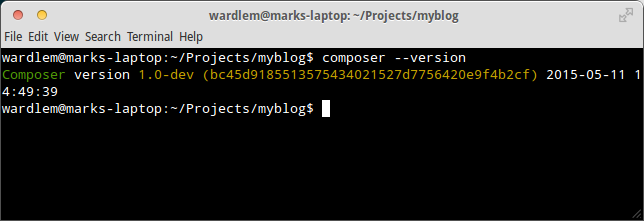

# How to properly set up a PHP application with composer and deploy it to Heroku - Part 2

## Getting Started

### Prerequisites

This guide assumes that you have PHP installed on your system.  This guide assumes at least PHP 5.5, but that doesn't mean it won't work on PHP 5.4.  If you are using an earlier version of PHP and something doesn't work you can either update your PHP installation to a newer version or adapt this guide to your requirements.  This guide isn't meant to give you one specific way of setting this up, but rather a general approach to doing so.  Adapt as needed.

### Setting up git

We are going to use git as our version control system.  There are two reasons for this. The first is that it's just a good idea to use a version control system and git is a popular one.  The second is that we plan on deploying our application to Heroku, and Heroku uses git for deployment.

The first thing we need to do is to create a new project directory.  Open up your terminal, use the `cd` command to navigate to the directory in which you keep your projects, and run the following commands to create the directory and intialize the git repository:

~~~~~~~~bash
$ mkdir myblog
$ cd myblog
$ git init
~~~~~~~~

Now that we have our directory and our repository initialized, we should add a file and make our initial commit.  For the most part we will be working in an editor rather than the command line, but for this task we will create a file using the terminal.  Issue the following commands to create nh `AUTHORS` file and then commit it.

~~~~~~~~bash
$ echo "Your Name Here" > AUTHORS
$ git add AUTHORS
$ git commit -m "Initial commit with AUTHORS file."
~~~~~~~~

### Installing composer

The next thing we need to do is to install Composer, the PHP package manager.  You can install composer globally or locally, but for this project we will install it globally.  This guide provides one method utilizing curl.  If you don't have curl, would like to set up composer locally, have any problems, or just want to know more about Composer, you can visit it's [home page](http://getcomposer.org).

Run the following in your terminal:

~~~~~~~~bash
$ curl -sS https://getcomposer.org/installer | php
~~~~~~~~

After the script runs compser should be installed you can verify that it is working by running `composer --version`.  For me, the result looks something like this:

If you see something similar then composer is good to go.  We will be using it quite a bit to get the components that we need for our project.

### Setting up the directory structure

The directory structure we will be using is pretty simple.  For security reasons, we don't want to put our application code within reach of the web.  We also want our application to have a single point of entry into our application.  As such, we will create a `public/` directory within our project's root directory which we will configure with the server to be our document root.  Within this directory we will put all of our public files (images, stylesheets, client-side scripts) as well as a single `app.php` file (you can name it whatever you want). No other php script will be within this directory or any of its sub-directories.

The majority of our application specific code will reside in a 'src/' directory including our models and controllers.  We will also need directories for configuration, templates, and command line scripts.  Go ahead and create directories and files so that it looks like the following:

~~~~~~~~
├── AUTHORS
├── bin/
├── cache/
│   └── templates/
├── config/
├── db/
├── public/
│   ├── app.php
│   ├── images/
│   ├── js/
│   └── styles/
├── src/
├── templates/
└── tests/
~~~~~~~~

With that out of the way, we are ready to start building our application.
